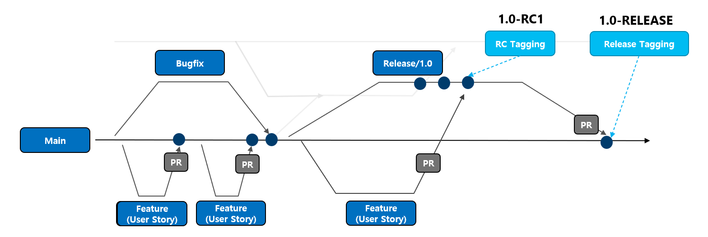
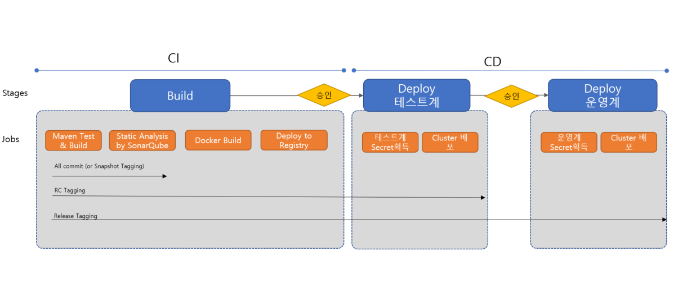

# Azure DevOps Hands-on

## 환경

* Azure Kubernetes Service(incl. Container Registry)
* Azure DevOps
* Azure KeyVault
* Azure PostgreSQL
* Spring Boot 프로젝트
* SonarQube
* GitHub Action or Azure Pipeline for CI/CD Pipeline
  * Azure Pipeline은 Code 방식 사용 (Classic X)
* Code Repository (GitHub or Azure Git Repo)

## 구성 시나리오 요약

1. Azure DevOps 보드 생성
2. DevOps Starter로 원클릭 구성
   * 한번에 K8S, Repo, Pipeline, 샘플 PJT, 모니터링 등 기본환경 구성
3. CI파이프라인 강화
    * SonarQube로 테스트 결과, 정점점검 결과 수집
4. CD파이프라인 강화
   * 개발계, 테스트계, 운영계 파아프라인 구성
   * 단계 별 승인과정 추가

## Azure DevOps 조직 구성

1. `https://dev.azure.com/` 로그인
2. `New Organization` 으로 새 조직 생성
    * Region은 `East asia` 선택
3. 프로젝트 생성
    * Version control은 `Git`
4. (옵션) GitHub 리파지토리 연결 필요 시
    * 생성된 프로젝트의 Project settings - GitHub Connections에서 GitHub 계정 연결
    * 리파티토리 선택 (복수개 선택 가능)

## Azure Board 구성

1. Delivery Plan 생성
2. 사용자스토리 워크샵 실시 - 백로그 생성
3. 스프린트 플래닝
    * 이터레이션 생성
    * 백로그 (사용자스토리) 스프린트 할당
4. 스프린트 착수
    * 스토리 포인트 산정
    * 코드 링킹

## Step by Step - DevOps Starter with Azure DevOps

> 참고문서: <https://docs.microsoft.com/ko-kr/azure/devops-project/overview>

### DevOps Starter에서 `create`로 신규 프로젝트를 생성

    * 랭귀지 선택 전 아래 그림과 같이 나오는 `here`링크를 통해 `Azure DevOps`와 `GitHub Action`중 하나를 선택할 수 있음. 
    

    > GitHub Action vs Azure DevOps?
    > <https://docs.microsoft.com/ko-kr/dotnet/architecture/devops-for-aspnet-developers/actions-vs-pipelines>

    * `Azure DevOps`선택
    * Language: `JAVA`, Framework: `Spring`, Service: `Kubernetes Service` 선택
    * Project name, Azure DevOps 조직, Kubernetes 신규 생성, 로케이션 Korea Central로 선택하여 생성.

### Git 설정

    > <https://git-scm.com/book/ko/v2/%EC%8B%9C%EC%9E%91%ED%95%98%EA%B8%B0-Git-%EC%B5%9C%EC%B4%88-%EC%84%A4%EC%A0%95>

    > Git ssh 공개키 생성: https://git-scm.com/book/ko/v2/Git-%EC%84%9C%EB%B2%84-SSH-%EA%B3%B5%EA%B0%9C%ED%82%A4-%EB%A7%8C%EB%93%A4%EA%B8%B0

### Azure Postgres 배포

    * 어플리케이션에서 사용할 DBMS 배포.

        [](https://portal.azure.com/#create/Microsoft.Template/uri/https%3A%2F%2Fraw.githubusercontent.com%2FAzure%2Fazure-quickstart-templates%2Fmaster%2Fquickstarts%2Fmicrosoft.dbforpostgresql%2Fmanaged-postgresql-with-vnet%2Fazuredeploy.json)

    * 생성 후 연결문자열, ID, 패스워드 등을 KeyVault로 관리 예정

### Azure KeyVault 생성

    * 이 [문서](https://docs.microsoft.com/ko-kr/azure/key-vault/general/quick-create-portal)를 참고하여 서비스 생성

    * 개체 > 비밀에서 아래 항목 생성
      * `postgres-pass`, `postgres-url`, `postgres-user`

### Azure DevOps 프로젝트 구성

#### Azure DevOps에서 ssh 공개키 등록


#### 실습코드 다운로드

```bash
    git clone https://github.com/HakjunMIN/azure-petclinic.git
```

#### 리파지토리 구성

```bash
    rm -rf .git
    git init
    git add . 
    git commit -am "first commit"
    git remote add origin <Your repo> # ex: git@ssh.dev.azure.com:v3/org/pjt/petclininc
    git push -u origin master
```

<!-- * Pipeline에서 생성할 Azure service connection설정
    * `Project Settings` - `Service Connections` 에서 신규 생성
        1) `Kubernetes`을 선택후 Subsciption, Cluster, Namespace를 선택 후 생성
        2) `Docker Registry`를 선택 후 Azure Container Registry, Subscription, 레지스트리 선택후 생성 -->

### CI/CD Pipelineing을 위한 Git Branch 전략

* GitHub Branch와 Git Branch 전략을 혼합하여 간결하지만 통제가 가능한 효율적인 Branch전략을 운영함.



* Main브랜치 기준으로 Feature 브랜치로 기능 개발. 계발계에 배포 필요할 경우 태깅으로 통제(ex: 1.0-SNAPSHOT1)
* Merge는 Pull Request(PR)로 리뷰 후 Merge할 수 있도록 강제
* 릴리즈를 위해서는 Release브랜치 생성. Main에 Merge되지 않은 Feature브랜치는 Release에 PR후 Merge
* RC버전 태깅(1.0-RC1)으로 Stage계 배포, RELEASE버전 태깅(1.0-RELEASE)으로 운영계 배포. 운영계 배포 후 Main에 Merge
* CI/CD 파이프라인은 Commit/PR/Tagging별로 동적 파이프라인을 구성. 예를 들면 Commit 은 기본 CI만 작동되고 PR은 CI 전체, Tagging은 개발계 or Stage계 or 운영계 배포 CD가 Trigger될 수 있도록 구성

### Azure Pipeline 구성

#### 목표 CI/CD 파이프라인



#### 초기 파이프라인 생성

* Pipelines - `Create Pipeline` - `Azure Repos Git` - <repository선택>
* `Configure your pipeline` - `Deploy To Azure Kubernetes Service`

클러스터, 네임스페이스, 컨테이너 레지스트리, 이미지 이름, 서비스 포트 지정

* `azure-pipelines.yml`의 코드가 자동으로 생성됨

#### Azure KeyVault Task 추가

> 배포 시 각종 비밀 정보를 가져오기 위한 연결임.

* `Show assistant`를 클릭하여 `Azure Key Vault`항목 추가

* 앞에서 생성한 KeyVault정보 입력하고 `Add`

#### Maven Task 및 SonarQube Task추가

> SonarQube Task는 SonarQube를 OSS로 사용할 경우 Branch 별 분석이 안되므로 `mvn sonar:sonar` goal을 사용하는 것을 추천

#### 완성된 파이프라인 코드 
##### Trigger 부문

* CI/CD 파이프라인을 1개의 코드로 관리. 코드로 분기하여 사용. 코드가 commit되면 무조건 실행 (CI/CD 포함)

```yaml
trigger:
    tags:
        include:
        - '*'
    branches:  
        include:
        - '*'
resources:
- repo: self

variables:

    # Container registry service connection established during pipeline creation
    dockerRegistryServiceConnection: 
    imageRepository:
    containerRegistry: 
    dockerfilePath: '**/Dockerfile'
    tag: '$(Build.BuildId)'
    imagePullSecret: 
    # Maven Caching
    MAVEN_CACHE_FOLDER: $(Pipeline.Workspace)/.m2/repository
    MAVEN_OPTS: '-Dmaven.repo.local=$(MAVEN_CACHE_FOLDER)'
    # Agent VM image name
    vmImageName: 'ubuntu-latest'
```

##### CI (Build 부문)

* Maven Test, Build, Docker Build 및 배포를 수행하나 Commit과 Tagging에 따라 어느 Job까지 실행될 것인지 `condition`을 통해 정의
* Maven repository를 재활용하기 위해 Cache Task활용
* SonarQube는 `mvn sonar:sonar` 형태로 Maven Goal로 실행

```yaml
stages:
- stage: Build
    displayName: Build stage
    jobs:
    - job: Build
    displayName: Build
    pool:
        vmImage: $(vmImageName)
        
    steps:
    - task: AzureKeyVault@1
        inputs:
        azureSubscription: 
        KeyVaultName:
        SecretsFilter: 'postgres-url, postgres-user, postgres-pass, sonar-url, sonar-token'           
        RunAsPreJob: false             

    - task: Cache@2
        displayName: Cache Maven local repo  
        inputs:
        key: 'maven | "$(Agent.OS)" | **/pom.xml'
        restoreKeys: |
            maven | "$(Agent.OS)"
            maven
        path: $(MAVEN_CACHE_FOLDER) 

    - task: Maven@3
        displayName: Maven Build
        inputs:
        mavenPomFile: 'Application/pom.xml'
        publishJUnitResults: true
        codeCoverageTool: 'jacoco'
        codeCoverageClassFilesDirectories:  'Application/target/classes, Application/target/testClasses'
        codeCoverageSourceDirectories: 'Application/src/java, Application/src/test'
        javaHomeOption: 'JDKVersion'
        jdkVersionOption: 1.11
        mavenVersionOption: 'Default'
        mavenOptions: '$(MAVEN_OPTS)'
        mavenAuthenticateFeed: false
        effectivePomSkip: false
        options: '-DPOSTGRES_URL=$(postgres-url) -DPOSTGRES_USER=$(postgres-user) -DPOSTGRES_PASS=$(postgres-pass)'
        goals: "-B package"
    
    - task: Maven@3
        displayName: Static Analysis on SonarQube
        inputs:     
        mavenPomFile: 'Application/pom.xml'
        mavenOptions: '$(MAVEN_OPTS)'
        goals: "-B sonar:sonar"
        options: "-Dsonar.projectKey=azure-spring -Dsonar.host.url=$(sonar-url) -Dsonar.login=$(sonar-token)"
    
    - task: Docker@2
        displayName: Build and push an image to container registry
        condition: OR(contains(variables['build.sourceBranch'], 'RC'), contains(variables['build.sourceBranch'], 'RELEASE'))
        inputs:
        command: buildAndPush
        repository: $(imageRepository)
        dockerfile: $(dockerfilePath)
        containerRegistry: $(dockerRegistryServiceConnection)
        tags: |
            $(tag)

    - upload: manifests
        condition: OR(contains(variables['build.sourceBranch'], 'RC'), contains(variables['build.sourceBranch'], 'RELEASE'))
        artifact: manifests
```

##### CD (Deploy) 부문

* Stage계와 Production계로 구분한 후 `environment`정의. environment별 리소스 (여기선 Kubernetes Resourcef)를 정의하고 다음과 같은 체크 항목을 정의할 수 있음.

| 구분    | 설명                                    |
| ---------- | ---------------------------------------------- |
| Approval | Deploy전 특정 사용자(그룹)에게 승인을 받아야함. |
| Branch Control  | 특정 브랜치에서만 배포가 되도록 구성 |
| Businees Hours  | 특정시간에만 배포가 가능하도록 설정 |


> 이 프로젝트에서는 Approval기능만 사용함. Branch Control은 파이프라인 코드 내 `condition`으로 통제

* CD 샘플 파이프라인 코드

```yaml
- stage: Deploy
    displayName: Deploy stage
    dependsOn: Build
    condition: OR(contains(variables['build.sourceBranch'], 'RC'), contains(variables['build.sourceBranch'], 'RELEASE'))

    jobs:
    - deployment: Deploy
        displayName: Deploy
        pool:
        vmImage: $(vmImageName)
        environment: 'stage.staged48e'
        strategy:
        runOnce:
            deploy:
            steps:
            - task: KubernetesManifest@0
                displayName: Create imagePullSecret
                inputs:
                action: createSecret
                secretName: $(imagePullSecret)
                dockerRegistryEndpoint: $(dockerRegistryServiceConnection)

            - task: KubernetesManifest@0
                displayName: Deploy to Kubernetes cluster
                inputs:
                action: deploy
                manifests: |
                    $(Pipeline.Workspace)/manifests/deployment.yml
                    $(Pipeline.Workspace)/manifests/secretproviderclass.yml
                    $(Pipeline.Workspace)/manifests/service.yml
                imagePullSecrets: |
                    $(imagePullSecret)
                containers: |
                    $(containerRegistry)/$(imageRepository):$(tag)

    - stage: Deploy_prod
    displayName: Deploy production
    dependsOn: Build
    condition: contains(variables['build.sourceBranch'], 'RELEASE')

    jobs:
    - deployment: Deploy
        displayName: Deploy
        pool:
        vmImage: $(vmImageName)
        environment: 'prod.prodd82'
        strategy:
        runOnce:
            deploy:
            steps:
            - task: KubernetesManifest@0
                displayName: Create imagePullSecret
                inputs:
                action: createSecret
                secretName: $(imagePullSecret)
                dockerRegistryEndpoint: $(dockerRegistryServiceConnection)

            - task: KubernetesManifest@0
                displayName: Deploy to Kubernetes cluster
                inputs:
                action: deploy
                manifests: |
                    $(Pipeline.Workspace)/manifests/deployment.yml
                    $(Pipeline.Workspace)/manifests/secretproviderclass.yml
                    $(Pipeline.Workspace)/manifests/service.yml
                imagePullSecrets: |
                    $(imagePullSecret)
                containers: |
                    $(containerRegistry)/$(imageRepository):$(tag)           

```
> Branch 조건은 ` contains(variables['build.sourceBranch'], 'RELEASE')`와 같이 통제하고 Stage는 `RC`, `RELEASE`, Production은 `RELEASE` Tagging시에만 Triggering되도록 구성.

#### 전체 [`azure-pipeline`](azure-pipelines.yml) 샘플 참고

